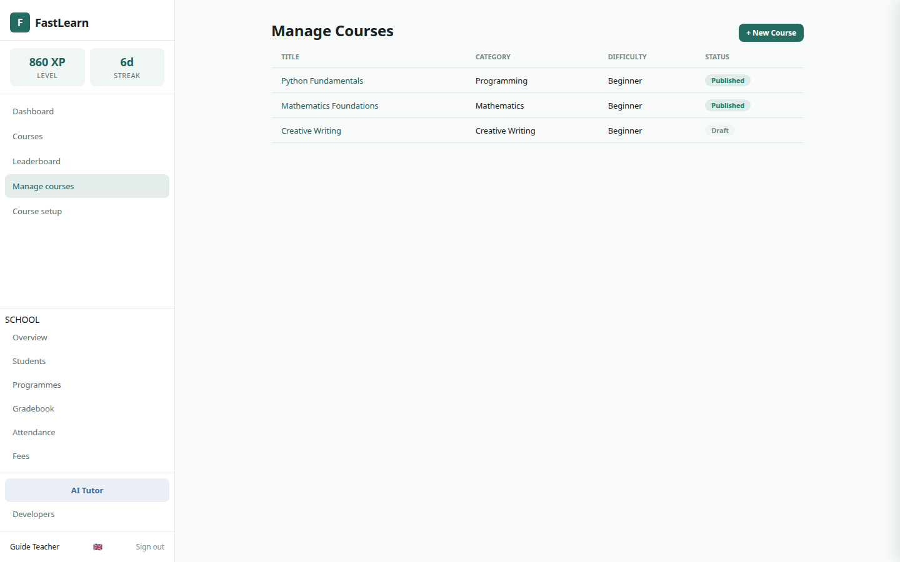

# FastLearn Platform Guide

**Published:** 2026-09-04  
**Platform:** [https://fastlearn.fun](https://fastlearn.fun)  
**Open-source foundation:** [FastLMS](https://lms.fastsme.com)  
**Languages:** English, Estonian and Lithuanian

This guide explains how students and teachers use FastLearn today and documents the approved role-based access, learning-time and adaptive-learning design for the next platform release.

> **Status legend**
>
> - **Available now** — present in the current FastLearn application.
> - **Approved next release** — agreed product behaviour that is not yet available in the live interface.

Screenshots were reviewed on 2026-09-04. Learner screens come from the current FastLearn product tour; teacher screens use a controlled documentation account on the same application build. No production learner data is shown.

## 1. Platform overview

FastLearn provides structured courses, focused lessons, quizzes, visible progress and an AI Tutor. The public product runs at `fastlearn.fun`; FastLMS remains the open-source implementation and developer-facing reference.


**Available now:**

- Ten published courses across programming, mathematics, science, language, geography and creative writing.
- Course modules, lessons, quizzes, XP, streaks, badges and a leaderboard.
- An AI Tutor grounded in the lesson being studied.
- English, Estonian and Lithuanian interface and course content.
- Google OAuth and password authentication.

**Approved next release:**

- Enforced admin, teacher and student permissions.
- Team invitations and teacher/course assignments.
- Active learning-time measurement.
- Linear and adaptive learning strategies.
- Teacher-reviewed AI generation for question variants and remedial or extension lessons.

## 2. Roles and permissions

| Capability | Admin | Teacher | Student |
|---|:---:|:---:|:---:|
| Browse all published courses | Yes | Yes | Yes |
| Learn from any published course | Yes | Yes | Yes |
| See own progress and active time | Yes | Yes | Yes |
| Create and edit assigned courses | Yes | Yes | No |
| Invite students to the platform | Yes | Yes | No |
| Assign students to a teacher-owned course | Yes | Yes | No |
| View learners in assigned courses | Yes | Yes | No |
| Manage all users, roles and courses | Yes | No | No |
| Promote teachers or admins | Yes | No | No |

`kaljuvee@gmail.com` is the initial administrator. Administrators may promote additional administrators. New accounts always begin without elevated privileges.

### Access principles

- Permissions are checked by the server, not merely by hiding navigation links.
- Teachers manage only courses assigned to them and only see learner records relevant to those courses.
- Teachers may invite a student to the whole platform. The invitation does not restrict the student to one course.
- Students can explore every published course.
- A course assigned by a teacher or administrator displays an **Assigned** tag. Self-selected courses remain available without that tag.
- Role changes, invitations and assignments are written to an audit log.

## 3. Signing in

Open [fastlearn.fun](https://fastlearn.fun) and select **Sign In**.


Students and teachers may use their email and password. Google SSO is available at [fastlearn.fun/auth/google](https://fastlearn.fun/auth/google); it returns the authenticated user to the FastLearn application. The registered callback is:

```text
https://fastlearn.fun/auth/google/callback
```

The original FastLMS callback remains registered separately. Never share a password, OAuth code or recovery token with another user.

## 4. Student guide

### 4.1 Browse the catalogue

Select **Courses** in the left navigation. Course cards show subject, difficulty, description and progress where applicable.


In the approved RBAC release, an **Assigned** tag will distinguish a teacher/admin assignment from a course the student chose independently. Assignment is a recommendation or curriculum requirement; it does not hide the rest of the catalogue.

### 4.2 Open a course and follow its path

Select a course card to see its modules, lessons and overall progress. In the default **linear** strategy, lessons follow the teacher-defined order.


Select a lesson title to begin. A completed indicator appears beside finished lessons, and the progress bar updates as the course advances.

### 4.3 Study a lesson

Lessons contain explanations, examples, practical material and optional media. The header shows expected duration and XP.


Use the actions at the end of a lesson to:

1. Mark the lesson complete.
2. Open its quiz, when provided.
3. Ask the AI Tutor for help in the current context.
4. Continue to the next recommended lesson.

### 4.4 Complete quizzes

Choose one answer for each question and submit the quiz. FastLearn displays the score, pass status, correct answers and explanations.


Quiz attempts contribute to progress and, in adaptive mode, to the learner's mastery estimate. An unsuccessful attempt is evidence for extra support—not a punishment or a permanent label.

### 4.5 Use the AI Tutor

Open **AI Tutor** from the navigation or from a lesson. When opened from a lesson, the tutor receives the relevant lesson context. Suggested prompts can request a simpler explanation, a practical example or a short knowledge check.


The tutor responds in the selected interface language unless the student asks for another language. Students should not submit passwords, private identifiers or information they are not permitted to share.

### 4.6 Understand active learning time

**Approved next release.** FastLearn will count active learning in three contexts:

- reading or interacting with a lesson;
- answering a quiz;
- using the AI Tutor within a course.

The browser sends a heartbeat every 30 seconds. Time pauses immediately when the tab is hidden and after 90 seconds without keyboard, pointer or touch activity. Returning to the page starts a new active interval. This prevents a page left open overnight from being counted as study time.

Students will see their own totals by course, lesson and day. Historical time before the feature is released cannot be reconstructed reliably.

### 4.7 Understand adaptive recommendations

**Approved next release.** Courses remain linear unless a teacher enables **adaptive** mode.

In adaptive mode:

- core lessons remain mandatory;
- prerequisites are always respected;
- optional lessons may be skipped;
- weak performance can insert an easier question set and a remedial lesson;
- sustained strong performance can raise question difficulty and prioritize an extension lesson;
- the student can see why a recommendation changed;
- a teacher can override the recommendation or restore the standard sequence.

The default rules are:

| Evidence | Adjustment |
|---|---|
| Recent accuracy below 60% | Reduce question difficulty by one level and queue relevant remedial material |
| Accuracy above 85% across two assessments | Increase difficulty by one level and prioritize an extension activity |
| Accuracy between those thresholds | Keep the current level |

FastLearn never changes by more than one difficulty level at a time and falls back to the nearest approved material when an exact match is unavailable.

## 5. Teacher guide

### 5.1 Manage assigned courses

Open **Manage courses** to review course title, subject, difficulty and publication status.



In the RBAC release, this list will contain only courses assigned to the teacher. Administrators retain access to every course.

### 5.2 Build and publish a course

Open **Course setup**. The authoring flow has five stages:

1. Create or select a course.
2. Add modules.
3. Add lessons.
4. Create quizzes and questions.
5. Review and publish.


Draft courses remain invisible to students until published. Teachers should preview titles, lesson order, answer options and translations before publication.

### 5.3 Invite and assign students

**Approved next release.** Teachers will open **Team**, enter the student's email and send an invitation through the existing Postmark service.

- Invitations do not expire.
- Each invitation is single-use and can be revoked.
- Accepting an invitation gives the learner access to the whole platform.
- The teacher may then assign the learner to one of the teacher's courses.
- An administrator may assign any learner to any course.
- Assigned courses display an **Assigned** tag in the learner catalogue.

Teachers cannot change a user's platform role. Administrators manage role promotion, suspension and reactivation.

### 5.4 Configure a learning strategy

**Approved next release.** Each course will have a **Learning strategy** section.

For **Linear**, configure the normal module and lesson order. For **Adaptive**, additionally configure:

- baseline and permitted difficulty range;
- low- and high-performance thresholds;
- number of recent assessments used as evidence;
- learning objectives covered by each question and lesson;
- prerequisite relationships;
- lesson type: `core`, `remedial`, `optional` or `extension`;
- whether a recommendation requires teacher review.

Core lessons cannot be skipped. Remedial and extension material can be inserted or prioritized according to mastery.

### 5.5 Generate material for approval

**Approved next release.** A teacher may request generated material for a selected learning objective. FastLearn will produce:

- easy, standard and challenging question variants;
- answer options, correct answer and explanation;
- remedial lesson drafts for common misconceptions;
- extension lesson drafts for learners ready to move further;
- English, Estonian and Lithuanian versions.

Generated material always starts as **Draft**. Before approval, the teacher should verify factual accuracy, difficulty, age appropriateness, wording, translations and that the correct answer appears exactly among the answer options. Only approved variants can be selected for students.

### 5.6 Review learner progress and time

**Approved next release.** Teachers will see reporting only for learners in their assigned courses. Reports will include:

- active time by course, lesson and day;
- completed and current lessons;
- quiz attempts and individual responses;
- mastery by learning objective;
- current adaptive difficulty;
- remedial or extension recommendations and their reasons.

Time is an engagement signal, not proof of understanding. It should be considered alongside assessment evidence and teacher observation.

## 6. Administrator guide

**Approved next release.** Administrators will use **Team** to:

- invite students or teachers;
- promote or demote roles;
- assign teachers to courses;
- assign any student to any course;
- revoke unused invitations;
- suspend or reactivate accounts;
- review role and assignment audit history;
- view platform-wide learning and time reports.

Role changes take effect on the next authorized request. The server will reject unauthorized direct URLs and form submissions even if a user attempts to bypass the interface.

## 7. Adaptive-learning decision process

The adaptive engine is deterministic and explainable:

1. Record the student's individual answers and the objectives tested.
2. Update mastery from recent approved evidence.
3. Compare performance with the course thresholds.
4. Move at most one difficulty level.
5. Filter candidate lessons by prerequisites and teacher approval.
6. Keep all core lessons, insert remedial work after difficulty, or prioritize extension work after sustained success.
7. Store the decision, evidence and rule used.
8. Show the student a plain-language reason and make the decision visible to the teacher.

If no approved material exists at the selected level, FastLearn uses the closest available approved question or returns to the teacher-defined linear path.

## 8. Language support

Use the flag selector in the navigation to switch between:

- English;
- Eesti;
- Lietuvių.

The selected language applies to navigation, course and lesson content, quizzes, answer explanations, AI Tutor prompts and generated drafts. Difficulty changes must never silently switch the learner's language.

## 9. Data and audit records

The approved release will retain:

- user role and status;
- invitations and their sender, recipient, use or revocation state;
- teacher/course and student/course assignments;
- active learning sessions and aggregated durations;
- quiz attempts and individual responses;
- mastery estimates and adaptive decisions;
- generated content versions and teacher approval decisions.

Access follows least privilege: students see their own data, teachers see relevant assigned-course data, and administrators see platform-wide records. Passwords and OAuth tokens are never part of learning analytics.

## 10. Quick reference

### Student

1. Sign in and choose a language.
2. Open an assigned course or explore the catalogue.
3. Work through the recommended lesson.
4. Complete its quiz.
5. Use AI Tutor when an explanation is unclear.
6. Review progress and, when released, active time and adaptive recommendations.

### Teacher

1. Open **Manage courses**.
2. Build content through **Course setup**.
3. Preview and publish the course.
4. When Team is released, invite students and assign them to teacher-owned courses.
5. Configure linear or adaptive learning.
6. Generate variants, review every draft and approve suitable material.
7. Monitor progress, mastery and active time.

### Support

- Product: [https://fastlearn.fun](https://fastlearn.fun)
- Open-source project: [https://github.com/predictivelabsai/FastLMS](https://github.com/predictivelabsai/FastLMS)
- FastLMS reference: [https://lms.fastsme.com](https://lms.fastsme.com)

