# FastLearn Platform Guide

**Published:** 2026-09-06<br>
**Release:** 1.4.0<br>
**Platform:** [https://fastlearn.fun](https://fastlearn.fun)  
**Open-source foundation:** [FastLMS](https://lms.fastsme.com)  
**Interface and catalogue languages:** English, Estonian, Lithuanian and Spanish<br>
**Language-learning targets:** English, Spanish, French, German, Italian, Portuguese, Mandarin Chinese, Arabic, Japanese and Hindi

This guide explains how students, teachers and the administrator use FastLearn, including role-based access, learning-time reporting and configurable adaptive learning.

Screenshots were reviewed on 2026-09-06. Learner screens come from the current FastLearn product tour; teacher screens use a controlled documentation account on the same application build. No production learner data is shown.

## 1. Platform overview

FastLearn provides structured courses, focused lessons, quizzes, visible progress and a chat-first learning experience. The public product runs at `fastlearn.fun`; FastLMS remains the open-source implementation and developer-facing reference.

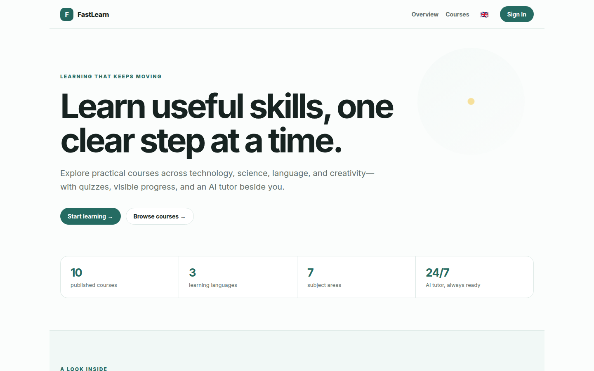

### Platform capabilities

- Fifteen admin-curated default courses across programming, mathematics, science, language and literature, geography, creative writing, art, music and chess.
- Course modules, lessons, quizzes, XP, streaks, badges and a leaderboard.
- A persistent **New Chat** workspace grounded in the selected course or lesson.
- Streamed questions, answer choices and feedback rendered inside chat rather than static learner forms.
- English, Estonian, Lithuanian and Spanish interface and course content.
- Native-to-target language practice across ten major languages.
- Google OAuth and password authentication.
- Enforced admin, teacher and student permissions.
- Team invitations and teacher/course assignments.
- Active learning-time measurement.
- Linear and adaptive learning strategies.
- Teacher-reviewed generation for question variants and remedial or extension lessons.
- Guided chessboards with server-side grading, adaptive practice and concept mastery records.
- Interactive visual explanations with hover, zoom, pan and accessible data for mathematics, physics, geography and art.
- A versioned integration API with public curriculum and protected learner operations.

## 2. Roles and permissions

| Capability | Admin | Teacher | Student |
|---|:---:|:---:|:---:|
| Browse the complete published catalogue | Yes | Yes | Yes |
| Learn from any published course | Preview | Preview | Yes |
| See learner progress and active time | All learners | Own assigned learners | Own only |
| Create a course | Yes | Yes | No |
| Edit a course | Any course | Own non-default courses | No |
| Clone an admin default into an editable draft | Yes | Yes | No |
| Invite students to the platform | Yes | Yes | No |
| Assign students to a teacher-owned course | Yes | Yes | No |
| View learners in assigned courses | Yes | Yes | No |
| Manage all users, roles and courses | Yes | No | No |
| Change users between teacher and student roles | Yes | No | No |

`kaljuvee@gmail.com` is the sole administrator. During signup, a new user chooses **Student** or **Teacher**, and the same choice is carried through password registration or Google SSO. Existing accounts keep their saved role when signing in again. Invitation roles take precedence, and no signup option can create another administrator. The administrator can later move other accounts between student and teacher.

### Access principles

- Permissions are checked by the server, not merely by hiding navigation links.
- The administrator owns and protects the default catalogue. Teachers can browse and assign those courses, but cannot edit the originals.
- Teachers edit only courses they created. A protected default can be cloned into a new teacher-owned draft and then adapted safely.
- Teachers see learner records only where that teacher made the course assignment, including assignments to admin defaults.
- Teachers may invite a student to the whole platform. The invitation does not restrict the student to one course.
- Students can explore every published course.
- A course assigned by a teacher or administrator displays an **Assigned** tag. Self-selected courses remain available without that tag.
- Role changes, invitations and assignments are written to an audit log.

## 3. Signing in

Open [fastlearn.fun](https://fastlearn.fun), select **Sign In**, then choose **Create your account**.

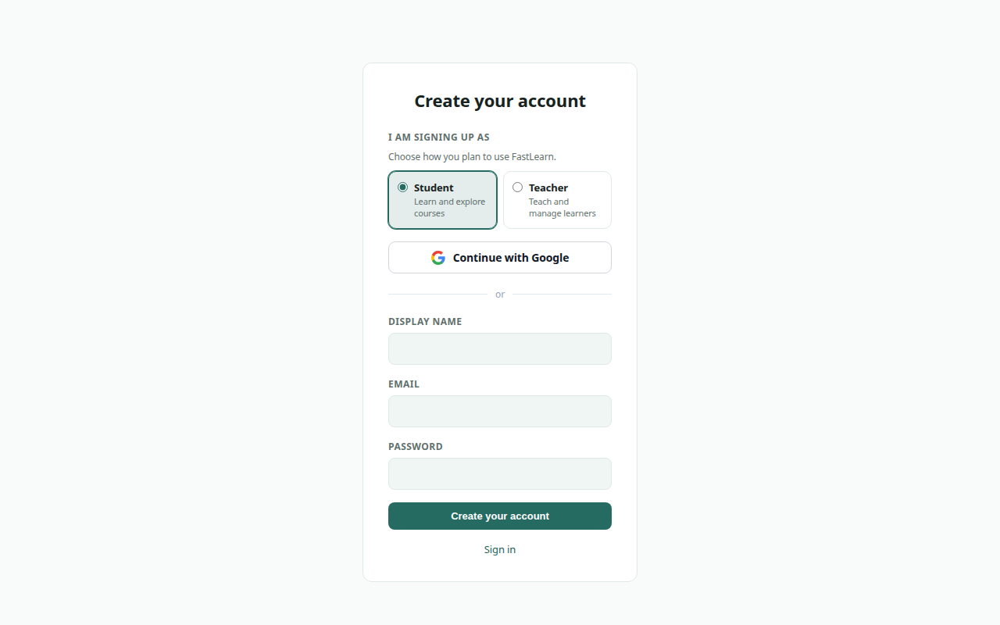

Students and teachers may use their email and password. Google SSO is available at [fastlearn.fun/auth/google](https://fastlearn.fun/auth/google); it returns the authenticated user to the FastLearn application. The registered callback is:

```text
https://fastlearn.fun/auth/google/callback
```

The original FastLMS callback remains registered separately. Never share a password, OAuth code or recovery token with another user.

On **Create account**, select **Student** to learn and explore courses or **Teacher** to teach and manage learners. The selected role also applies when **Continue with Google** is used from that signup screen. Returning Google users retain their existing database role.

## 4. Student guide

### 4.1 Start in New Chat

After login, a student lands in **New Chat**. The opening message asks what the student would like to learn and presents the complete course catalogue as lettered choices. Select a visible option or reply with its letter, such as `A`.

The selected course, lesson content, quiz choices and feedback all arrive in the conversation using streamed updates. Markdown headings, lists, examples and code are rendered as safe HTML rather than displayed as raw `**` or `###` text. Chat history is saved in the left rail, and **+ New Chat** starts a separate learning conversation.

### 4.2 Browse the catalogue

Select **Courses** in the left navigation. Course cards show subject, difficulty, description and progress where applicable.

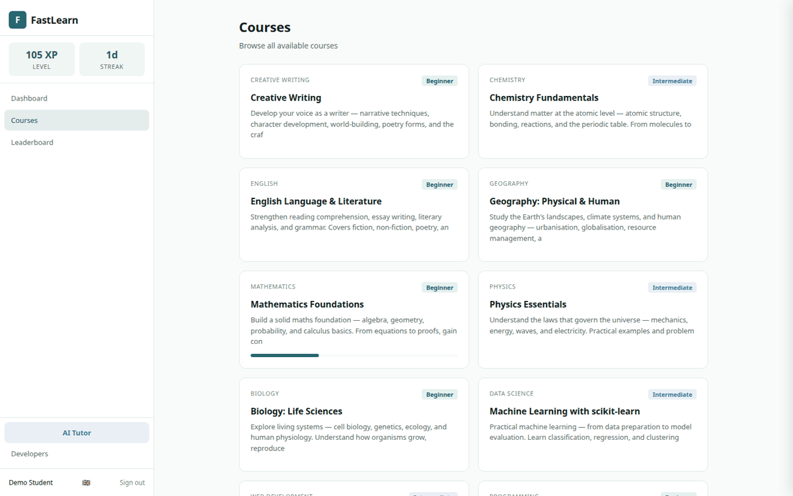

An **Assigned** tag distinguishes a teacher/admin assignment from a course the student chose independently. Assignment is a recommendation or curriculum requirement; it does not hide the rest of the catalogue.

### 4.3 Open a course and follow its path

Selecting a course from the catalogue or chat opens its learning conversation. In the default **linear** strategy, lessons follow the teacher-defined order. The dashboard and catalogue remain available when the student wants a visual overview rather than a conversation.

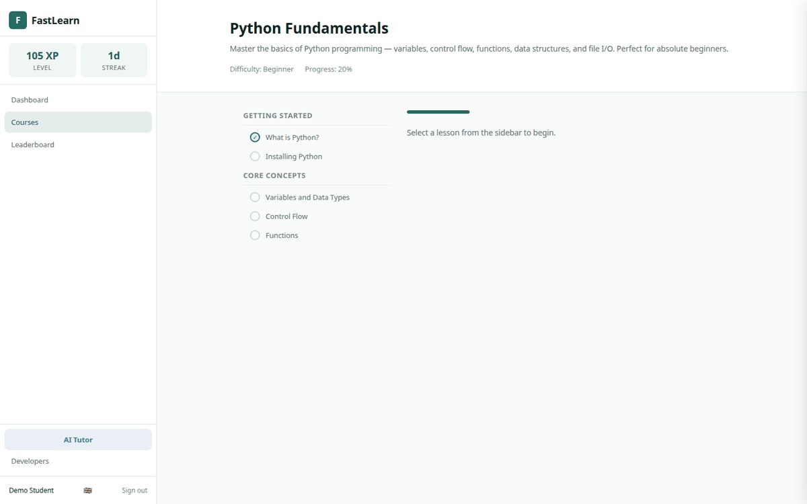

Select a lesson title to begin. A completed indicator appears beside finished lessons, and the progress bar updates as the course advances.

### 4.4 Study a lesson

Lessons contain explanations, examples, practical material and optional media. The header shows expected duration and XP.

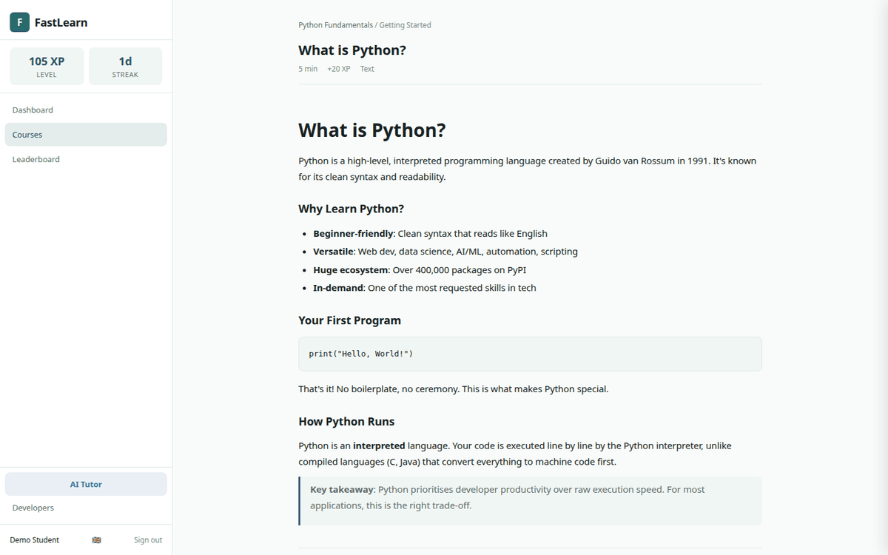

Use the chat choices to:

1. Mark the lesson complete.
2. Open its quiz, when provided.
3. Ask New Chat for help in the current context.
4. Continue to the next recommended lesson.

### 4.5 Complete quizzes

Choose one answer in chat, or reply with its displayed letter. FastLearn streams the score, pass status, correct answer and explanation into the same conversation.

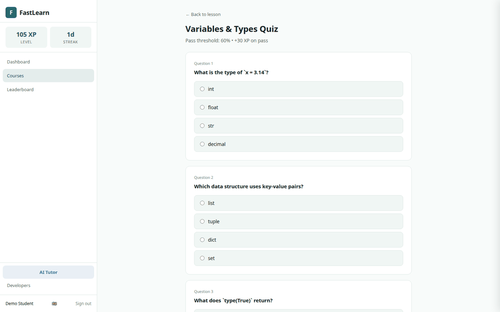

Quiz attempts contribute to progress and, in adaptive mode, to the learner's current difficulty and recommendation state. An unsuccessful attempt is evidence for extra support—not a punishment or a permanent label.

### 4.6 Explore a visual explanation

Supported mathematics, physics, geography and art lessons place an interactive visual directly below the lesson explanation. Hover over points or shapes to inspect values, zoom or pan when detail matters, and use the toolbar to reset the view.

Every visual includes a plain-language description and an expandable **View accessible data** table. The same concept therefore remains available without relying only on colour, pointer interaction or sight.

Students can also ask **“Show me this visually”**, **“Plot this”** or **“Draw a diagram”** in a supported lesson. FastLearn streams the written explanation first and then attaches the relevant visual. The model selects a safe template; it never sends executable JavaScript to the browser.

Visuals saved permanently into teacher-owned courses enter the existing draft queue. A teacher reviews and approves the English, Estonian, Lithuanian and Spanish versions before the visual becomes part of the lesson.

### 4.7 Learn chess with guided boards

Open **Chess Foundations I** from the catalogue. This protected default course is written for beginner children aged 3–12 and contains ten original lessons covering the board, coordinates, pieces, rooks, bishops, queens and knights.

Choose **Practise on the chessboard** inside a lesson. Depending on the activity, the student can:

- choose an answer;
- select every reachable square;
- place pieces on their starting squares;
- build a shortest route; or
- capture a sequence of pieces.

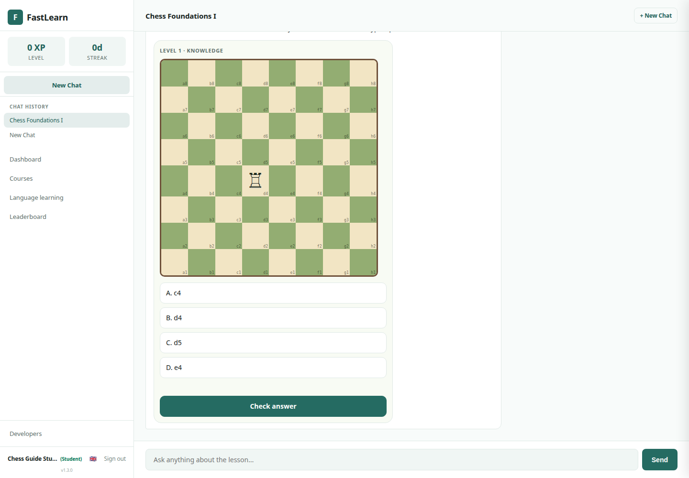

Select squares or pieces directly and choose **Check answer**. The answer is graded on the server and feedback streams into the same chat. The expected answer is never sent to the browser. Keyboard learners may type `A`, square lists such as `d1 d2 d3`, move lists such as `a1a8 a8h8`, or placements such as `R@a1 R@h1`.

The default lesson order remains linear. Exercise attempts still update bounded difficulty: difficulty can fall after mistakes and rise after sustained success. FastLearn records the concept, Skill/Knowledge/Wisdom layer, result and active duration for later teacher reporting. The current Foundations I scope is guided practice only; it does not include engine games or live opponents.

### 4.8 Use New Chat

Open **New Chat** from the navigation or from a lesson. When opened from a lesson, the chat receives the relevant lesson context. Suggested prompts can request a simpler explanation, a practical example or a short knowledge check.

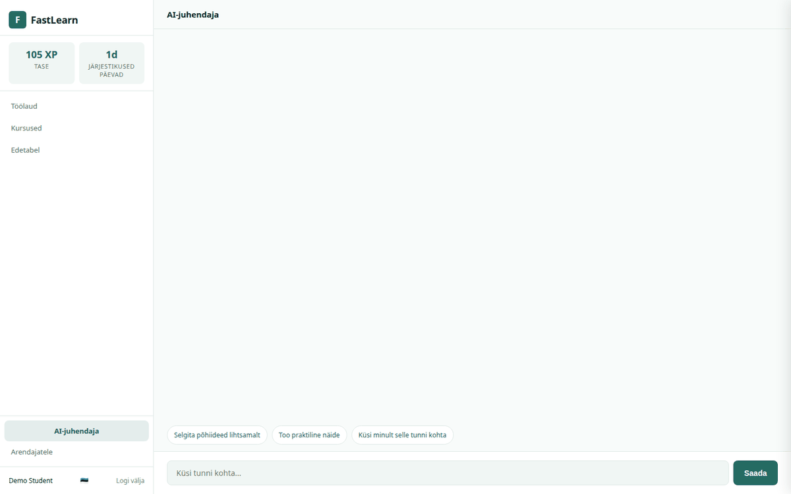

The tutor responds in the selected interface language unless the student asks for another language. Students should not submit passwords, private identifiers or information they are not permitted to share.

### 4.9 Understand active learning time

FastLearn counts active learning in three contexts:

- reading or interacting with a lesson;
- answering a quiz;
- using New Chat within a course.

The browser sends a heartbeat every 30 seconds. Time pauses immediately when the tab is hidden and after 90 seconds without keyboard, pointer or touch activity. Returning to the page starts a new active interval. This prevents a page left open overnight from being counted as study time.

Students see their total active time on their profile. Teachers see the lesson, quiz and New Chat split for their own assignments. Historical time from before tracking was enabled cannot be reconstructed reliably.

### 4.10 Understand adaptive recommendations

Courses remain linear unless a teacher enables **adaptive** mode.

In adaptive mode:

- core lessons remain mandatory;
- prerequisites are always respected;
- optional lessons may be skipped;
- weak performance can insert an easier question set and a remedial lesson;
- sustained strong performance can raise question difficulty and prioritize an extension lesson;
- the student can see why a recommendation changed;
- a teacher can override the recommendation or restore the standard sequence.

The default rules are:

| Evidence | Adjustment |
|---|---|
| Recent accuracy below 60% | Reduce question difficulty by one level and queue relevant remedial material |
| Accuracy above 85% across two assessments | Increase difficulty by one level and prioritize an extension activity |
| Accuracy between those thresholds | Keep the current level |

FastLearn never changes by more than one difficulty level at a time and falls back to the nearest approved material when an exact match is unavailable.

### 4.11 Learn another language

Open **Language learning** in the left navigation. Choose the language the student already speaks, the target language and a daily practice goal.

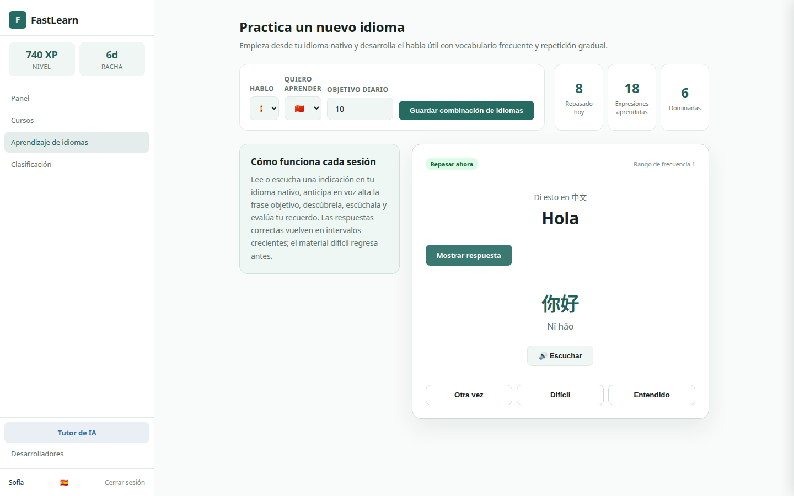

#### Supported language pairs

The target-language engine currently supports:

- English;
- Spanish;
- French;
- German;
- Italian;
- Portuguese;
- Mandarin Chinese;
- Modern Standard Arabic;
- Japanese;
- Hindi.

Estonian and Lithuanian are also available as native starting languages. This lets a student begin with familiar instructions even when the target language uses another script.

#### How practice works

Each practice turn follows an audio-first recall loop:

1. Read the meaning in the native language.
2. Anticipate and say the target expression aloud before revealing it.
3. Reveal the target expression and its romanisation where appropriate.
4. Listen to browser-generated pronunciation.
5. Rate recall as **Again**, **Hard** or **Got it**.
6. Let FastLearn schedule the next appearance.

The initial dictionary contains 30 frequency-informed words and functional expressions aligned across every supported language. Difficult expressions return sooner. Successful recall expands from short in-session intervals to hours, days and months. This is a Pimsleur-style use of anticipation and graduated interval recall with original content; FastLearn does not reproduce proprietary Pimsleur lessons or recordings.

## 5. Teacher guide

### 5.1 Start with the teacher workspace

A teacher lands in **New Chat** with the prompt **“What would you like your students to learn?”** The conversation shows the complete published catalogue followed by shortcuts to create a course, assign and manage learners, review drafts, open reports, or preview the student experience. Selecting an option guides the teacher to the appropriate workspace; it does not silently make administrative changes.

Teacher navigation and profile screens show operational measures—**Students**, **Active courses** and **Pending approvals**—instead of learner XP and streaks. The administrator sees **Users**, **Published courses** and **Approvals**.

### 5.2 Browse and manage courses

Open **Manage courses** to review course title, subject, difficulty and publication status.

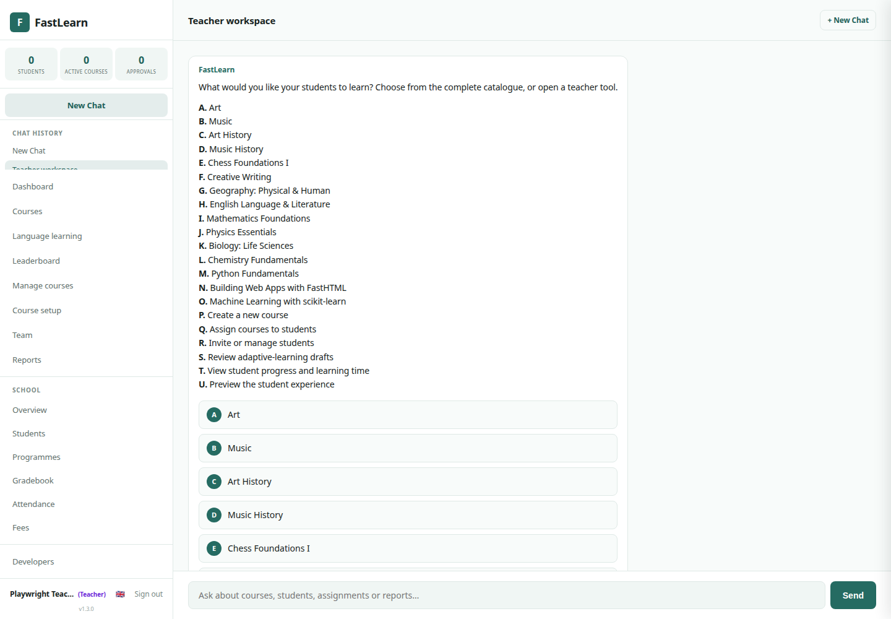

The catalogue contains every published course. **Manage courses** contains only the teacher's own editable, non-default courses. The administrator retains edit access to every course.

Admin-curated defaults display an **Admin default** tag. A teacher can assign a default immediately or choose **Clone course**. Cloning creates a private teacher-owned draft with copied modules, lessons, quizzes, questions, translations, prerequisites and learning-strategy settings. Learner progress and attempts are never copied. The teacher edits and publishes the clone without changing the protected original.

### 5.3 Build and publish a course

Open **Course setup**. The authoring flow has five stages:

1. Create or select a course.
2. Add modules.
3. Add lessons.
4. Create quizzes and questions.
5. Review and publish.

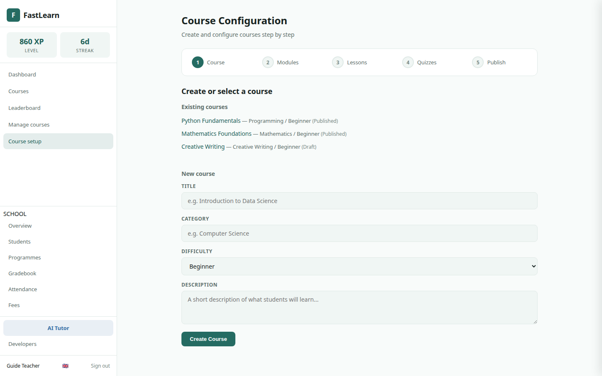

Draft courses remain invisible to students until published. Teachers should preview titles, lesson order, answer options and translations before publication.

### 5.4 Invite and assign students

Open **Team**, enter the student's email and send an invitation through the existing Postmark service.

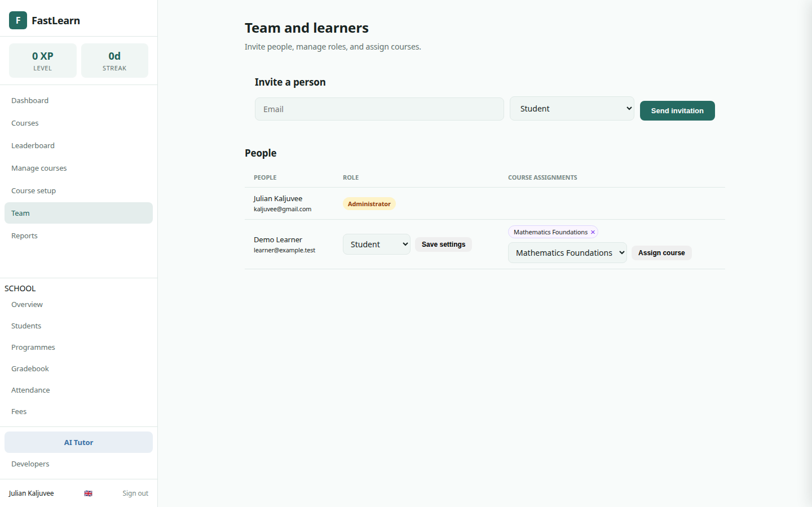

- Invitations do not expire.
- Each invitation is single-use and can be revoked.
- Accepting an invitation gives the learner access to the whole platform.
- The teacher may then assign the learner to any published course in the complete catalogue, including protected admin defaults, or to one of the teacher's own drafts.
- An administrator may assign any learner to any course.
- Assigned courses display an **Assigned** tag in the learner catalogue.

Teachers cannot change a user's platform role. The administrator can change users between student and teacher roles and can grant teachers access to courses.

### 5.5 Configure a learning strategy

Open **Manage courses**, then select **Learning strategy** for a course.

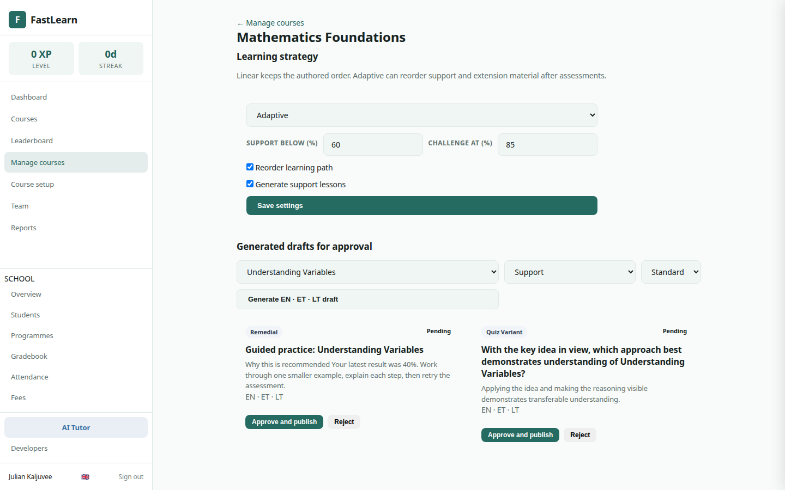

**Linear** preserves the normal module and lesson order. For **Adaptive**, configure:

- low- and high-performance thresholds;
- whether recommendations may reorder the path;
- whether FastLearn should generate support lessons;
- lesson type: `core`, `remedial` or `optional`;
- question difficulty: easier, standard or harder.

Core lessons determine required course completion. Remedial and optional extension material can be inserted or prioritized according to performance; explicit prerequisites remain ahead of dependent lessons.

### 5.6 Generate material for approval

A teacher may request generated material for a selected lesson. FastLearn produces:

- easy, standard and challenging question variants;
- answer options, correct answer and explanation;
- remedial lesson drafts for common misconceptions;
- extension lesson drafts for learners ready to move further;
- English, Estonian, Lithuanian and Spanish versions.

Generated material always starts as **Pending**. Before approval, the teacher should verify factual accuracy, difficulty, age appropriateness, wording, translations and that the correct answer appears exactly among the answer options. Only approved variants become lessons or quiz questions.

### 5.7 Review learner progress and time

Teachers see reporting only for student/course assignments made by that teacher. This applies equally to teacher-owned courses and shared admin defaults, preventing one teacher from seeing another teacher's learners. The administrator sees platform-wide reporting.

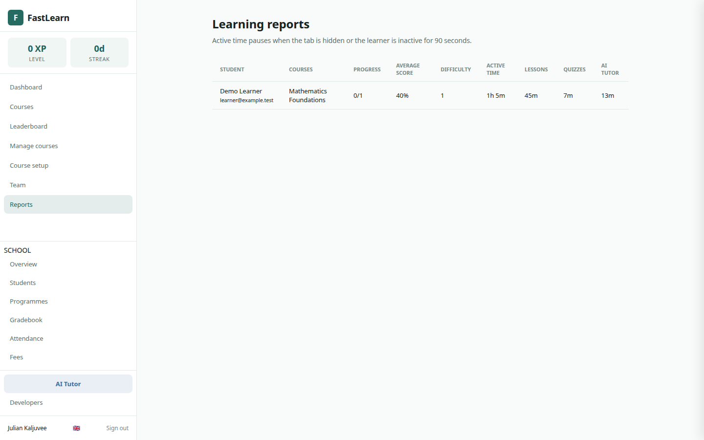

Reports include:

- active time by course, split across lessons, quizzes and New Chat;
- completed core lessons;
- average quiz score;
- current adaptive difficulty;
- the learner and course associated with each total.

Time is an engagement signal, not proof of understanding. It should be considered alongside assessment evidence and teacher observation.

## 6. Administrator guide

The administrator uses **Team** to:

- invite students or teachers;
- change student and teacher roles;
- assign teachers to courses;
- assign any student to any course;
- own and maintain the protected default course catalogue;
- review every course while teachers remain limited to their own authored clones and courses;
- revoke unused invitations;
- view platform-wide learning and time reports.

Role changes take effect on the next authorized request. The server will reject unauthorized direct URLs and form submissions even if a user attempts to bypass the interface.

## 7. Adaptive-learning decision process

The adaptive engine is deterministic and explainable:

1. Record the student's individual answers and assessment score.
2. Update the learner's course difficulty and consecutive-high-score count.
3. Compare performance with the course thresholds.
4. Move at most one difficulty level.
5. Select the nearest approved question difficulty and keep prerequisites ahead of dependent lessons.
6. Keep all core lessons, insert remedial work after difficulty, or prioritize extension work after sustained success.
7. Store the decision, evidence and rule used.
8. Show the student a plain-language reason and make the decision visible to the teacher.

If no approved material exists at the selected level, FastLearn uses the closest available approved question or returns to the teacher-defined linear path.

## 8. Language support

Use the flag selector in the navigation to switch between:

- English;
- Eesti;
- Lietuvių;
- Español.

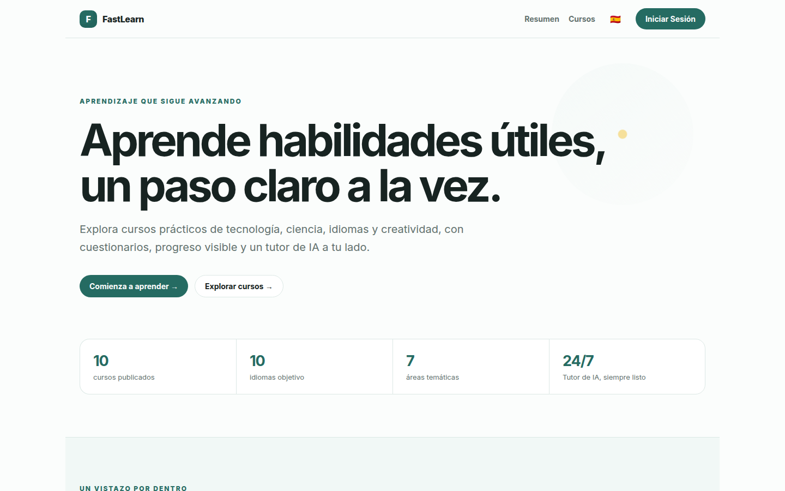

The selected language applies to navigation, course and lesson content, quizzes, answer explanations, New Chat prompts and generated drafts. Difficulty changes must never silently switch the learner's language.

The interface language and language-learning pair are independent. For example, a student can use the Spanish interface while learning Mandarin Chinese from English, or use the Estonian interface while learning Spanish from Estonian.

## 9. Data and audit records

FastLearn retains:

- user role and status;
- invitations and their sender, recipient, use or revocation state;
- teacher/course and student/course assignments;
- active learning sessions and aggregated durations;
- quiz attempts and individual responses;
- adaptive difficulty, recommendations and their assessment evidence;
- generated content versions and teacher approval decisions.
- native and target language preferences, recall ratings and next-due intervals;
- chat sessions and messages needed to restore learning history.
- guided exercise attempts, board answers, concepts, difficulty and active duration.

Access follows least privilege: students see their own data, teachers see relevant assigned-course data, and administrators see platform-wide records. Passwords and OAuth tokens are never part of learning analytics.

## 10. Integration API

Open [FastLearn Developers](https://fastlearn.fun/developers), [Swagger UI](https://fastlearn.fun/api/docs), or [ReDoc](https://fastlearn.fun/api/redoc). The API is versioned under `/api/v1`.

Published curriculum is public:

- courses, modules and lessons;
- complete course curriculum trees;
- answer-safe guided exercises;
- anonymous exercise checking that returns a verdict but never the answer key.

Learner information is private. Configure `FASTSME_API_TOKEN` and send `Authorization: Bearer <token>` to access learner lists, assignments, enrolments, progress, recorded attempts, chat sessions or chat messages. Public API records never include password hashes, OAuth credentials or private exercise answers.

```bash
curl "https://fastlearn.fun/api/v1/courses?lang=es"

curl "https://fastlearn.fun/api/v1/learners/42/progress" \
  -H "Authorization: Bearer $FASTSME_API_TOKEN"
```

## 11. Quick reference

### Student

1. Sign in and choose a language.
2. Open an assigned course or explore the catalogue.
3. Work through the recommended lesson.
4. Complete its quiz.
5. Ask for a simpler explanation in New Chat when something is unclear.
6. Review progress, active time and adaptive recommendations.
7. Open **Language learning** to practise a chosen target language from the student's native language.
8. Open **Chess Foundations I** to practise interactively without leaving New Chat.

### Teacher

1. Start in **New Chat** and choose a course or teacher action.
2. Browse the complete catalogue and assign a protected default, or clone it into an editable draft.
3. Build teacher-owned content through **Course setup**.
4. Preview and publish the course.
5. Use **Team** to invite students and assign any published course.
6. Configure linear or adaptive learning on teacher-owned courses.
7. Generate variants, review every draft and approve suitable material.
8. Monitor the teacher's assigned learners, adaptive difficulty and active time.

### Support

- Product: [https://fastlearn.fun](https://fastlearn.fun)
- Open-source project: [https://github.com/predictivelabsai/FastLMS](https://github.com/predictivelabsai/FastLMS)
- FastLMS reference: [https://lms.fastsme.com](https://lms.fastsme.com)
