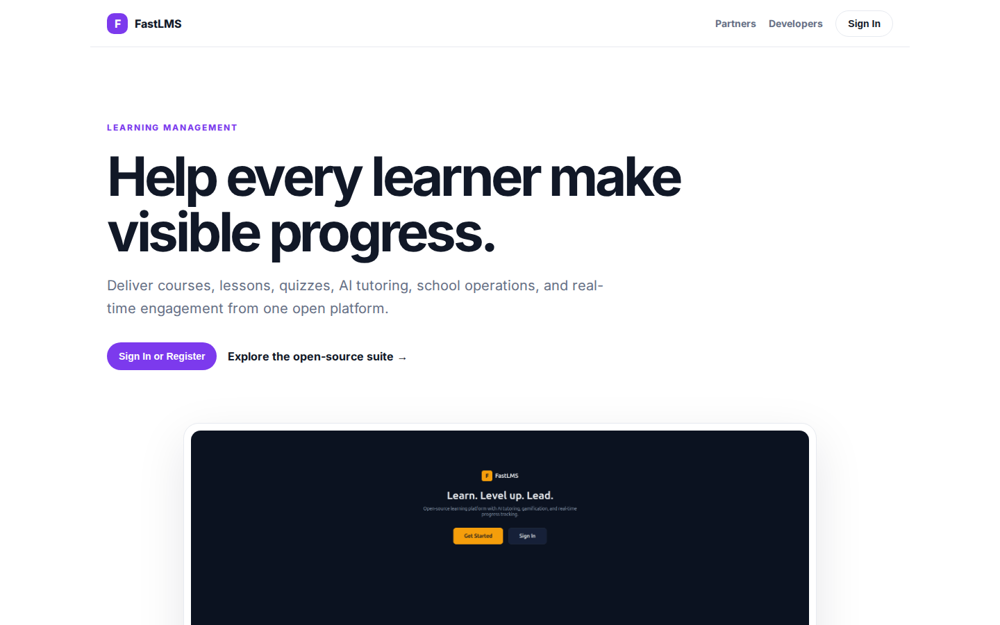
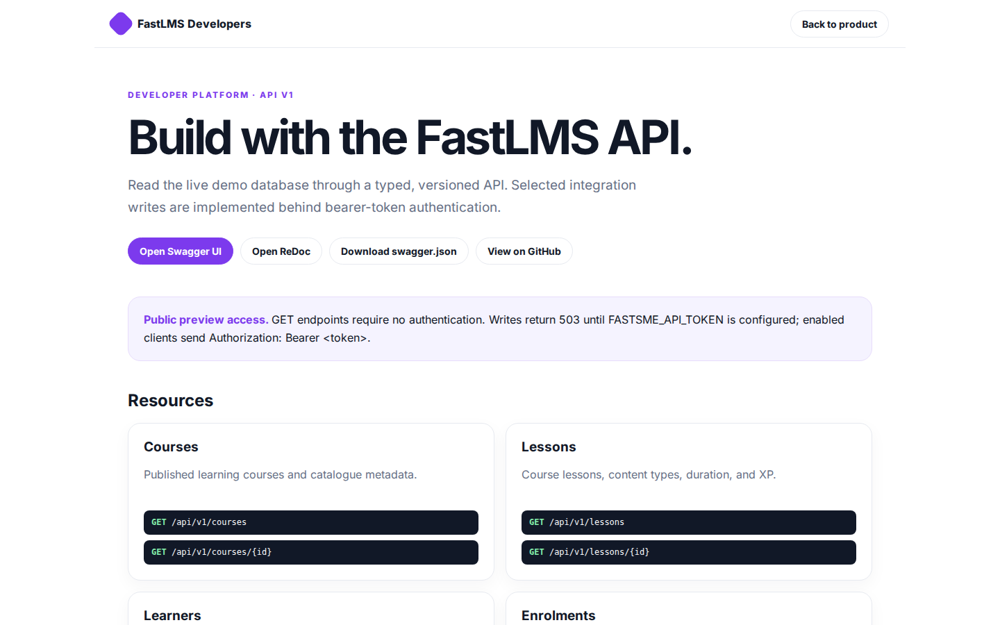
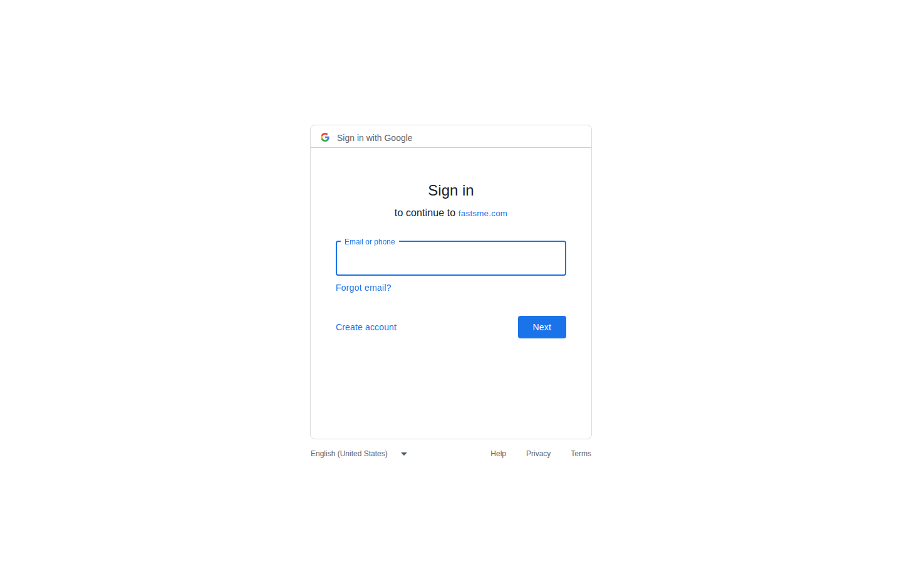

# FastLMS Platform Guide

**Published:** 2026-08-19
**Platform:** [https://lms.fastsme.com](https://lms.fastsme.com)
**Source:** [github.com/predictivelabsai/FastLMS](https://github.com/predictivelabsai/FastLMS)

## Platform overview

Open-source learning management system built with . Python-first, no JavaScript framework — HTMX handles all interactivity. Features a 3-pane layout, AI tutor chat with SSE streaming, and Duolingo-style interactive elements (XP, streaks, badges, leaderboards, levels).

This visual guide was reviewed against the live product using Playwright. Screens and available navigation can vary by account, role, and deployment configuration.

## 1. Help every learner make visible progress.

LEARNING MANAGEMENT Help every learner make visible progress. Deliver courses, lessons, quizzes, AI tutoring, school operations, and real-time engagement from one open platform. Sign In or Register Explore the open-source suite → Product tour · see the workspa

Screen reviewed at: [https://lms.fastsme.com/](https://lms.fastsme.com/)

## 2. Build with the FastLMS API.

FastLMS Developers Back to product DEVELOPER PLATFORM · API V1 Build with the FastLMS API. Read the live demo database through a typed, versioned API. Selected integration writes are implemented behind bearer-token authentication. Open Swagger UI Open ReDoc Do

Screen reviewed at: [https://lms.fastsme.com/developers](https://lms.fastsme.com/developers)

## 3. Sign in

Sign in with Google Sign in to continue to fastsme.com Email or phone Forgot email? Next Create account Afrikaans azərbaycan bosanski català Čeština Cymraeg Dansk Deutsch eesti English (United Kingdom) English (United States) Español (España) Español (Latinoam

Screen reviewed at: [https://accounts.google.com/v3/signin/identifier?opparams=%253F&dsh=S-1976092630%3A1787122782089365&access_type=online&client_id=887059023987-2a7spj1m82eivobdbt1itb3cqca6tpt1.apps.googleusercontent.com&o2v=2&prompt=select_account&redirect_uri=https%3A%2F%2Flms.fastsme.com%2Fauth%2Fgoogle%2Fcallback&response_type=code&scope=openid+email+profile&service=lso&state=21uld0_OgbbgfYGM6qpX5PplPsfvnTzdIrJYWatk7pI&flowName=GeneralOAuthLite&continue=https%3A%2F%2Faccounts.google.com%2Fsignin%2Foauth%2Flegacy%2Fconsent%3Fauthuser%3Dunknown%26part%3DAJi8hANBPsCcm4V2GqlVQjSWvdfUe-_k9B0WBsUgmRnOZlyVrewVfrw9_d80ZZRvcYZLQAAphQjaN5o6FPhgleLBT_SPHGmBPeqL820Y3MZk59PIdqWYynX9dRdSpEevCQ1l81DyQ9jwGKj7HKyTbLZRL8yGMpvbuvEGswha7xp56WYCATi9K0vlnCCcf4eRNp_GF0sPBbVrng4FX1mAPatnLO9fDxqDekEjjI7vN0ervqVL6n3JKtJH_zc3pBxGLOextPIk-6YPrAsP_dwPUOO7j4B2irKIyESXth1x3bXvD2asmb-Sg0iwb1u_r-vZ3tcp54pIb7SNdqQhiUj_uisXbYIBL-XPYu8nFBvvK9-ZoRMZk93yVstjkbFwET3bF1Ms-VZoxy_b5PCdngwhH0dOvXZz_9QJ4Rz2SO5uDEd5oOrmAvZjCBC17s8sbPbEUSyA7gZilp1KICng1JgYRgUiorrswazSHg%26flowName%3DGeneralOAuthFlow%26as%3DS-1976092630%253A1787122782089365%26client_id%3D887059023987-2a7spj1m82eivobdbt1itb3cqca6tpt1.apps.googleusercontent.com%23&app_domain=https%3A%2F%2Flms.fastsme.com&rart=ANgoxceETOgZ9Tqeda1I5Cz_-GrzAugrQDkGnUtq9SWOvevXW7fiE3aVXUpbSgdXzfJWJUuq1nMLrJ3PoR2_Y3kCdWVG1_ORT5zq2yxQU_tlK8NesiTV9rA](https://accounts.google.com/v3/signin/identifier?opparams=%253F&dsh=S-1976092630%3A1787122782089365&access_type=online&client_id=887059023987-2a7spj1m82eivobdbt1itb3cqca6tpt1.apps.googleusercontent.com&o2v=2&prompt=select_account&redirect_uri=https%3A%2F%2Flms.fastsme.com%2Fauth%2Fgoogle%2Fcallback&response_type=code&scope=openid+email+profile&service=lso&state=21uld0_OgbbgfYGM6qpX5PplPsfvnTzdIrJYWatk7pI&flowName=GeneralOAuthLite&continue=https%3A%2F%2Faccounts.google.com%2Fsignin%2Foauth%2Flegacy%2Fconsent%3Fauthuser%3Dunknown%26part%3DAJi8hANBPsCcm4V2GqlVQjSWvdfUe-_k9B0WBsUgmRnOZlyVrewVfrw9_d80ZZRvcYZLQAAphQjaN5o6FPhgleLBT_SPHGmBPeqL820Y3MZk59PIdqWYynX9dRdSpEevCQ1l81DyQ9jwGKj7HKyTbLZRL8yGMpvbuvEGswha7xp56WYCATi9K0vlnCCcf4eRNp_GF0sPBbVrng4FX1mAPatnLO9fDxqDekEjjI7vN0ervqVL6n3JKtJH_zc3pBxGLOextPIk-6YPrAsP_dwPUOO7j4B2irKIyESXth1x3bXvD2asmb-Sg0iwb1u_r-vZ3tcp54pIb7SNdqQhiUj_uisXbYIBL-XPYu8nFBvvK9-ZoRMZk93yVstjkbFwET3bF1Ms-VZoxy_b5PCdngwhH0dOvXZz_9QJ4Rz2SO5uDEd5oOrmAvZjCBC17s8sbPbEUSyA7gZilp1KICng1JgYRgUiorrswazSHg%26flowName%3DGeneralOAuthFlow%26as%3DS-1976092630%253A1787122782089365%26client_id%3D887059023987-2a7spj1m82eivobdbt1itb3cqca6tpt1.apps.googleusercontent.com%23&app_domain=https%3A%2F%2Flms.fastsme.com&rart=ANgoxceETOgZ9Tqeda1I5Cz_-GrzAugrQDkGnUtq9SWOvevXW7fiE3aVXUpbSgdXzfJWJUuq1nMLrJ3PoR2_Y3kCdWVG1_ORT5zq2yxQU_tlK8NesiTV9rA)

## Getting started

Visit [https://lms.fastsme.com](https://lms.fastsme.com) to explore FastLMS. For source code and deployment details, use the GitHub link above.
