# FastLMS User Guide

## Getting Started

### 1. Landing Page

Visit the FastLMS URL to see the landing page. Click **Get Started** to create an account or **Sign In** if you already have one.

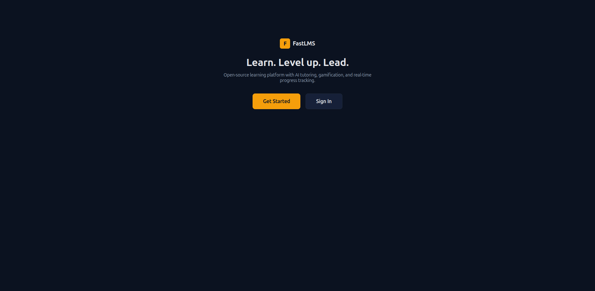

### 2. Sign In

Enter your email and password. Demo accounts are available after seeding:
- **Student**: `student@fastlms.dev` / `admin`
- **Instructor**: `instructor@fastlms.dev` / `admin`

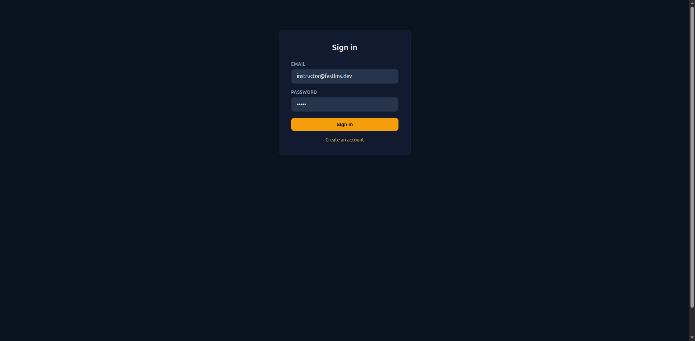

### 3. Dashboard

After signing in you land on your dashboard. It shows your XP, level, streak, and lessons completed at a glance. Below the stats you'll see your enrolled courses and any courses available to browse.

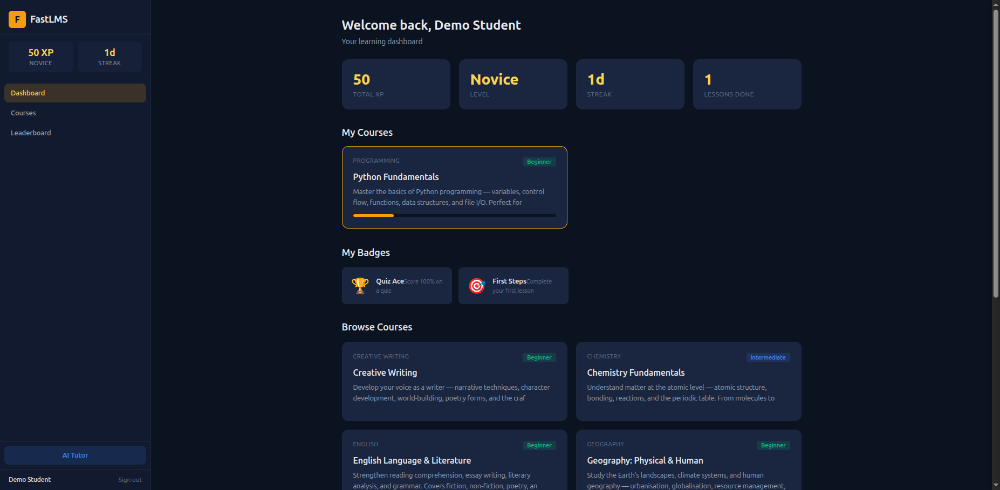

---

## Learning

### 4. Browse Courses

Click **Courses** in the left nav to see all published courses. FastLMS ships with 10 courses across multiple subjects:

| Category | Courses |
|----------|---------|
| Programming | Python Fundamentals |
| Data Science | Machine Learning with scikit-learn |
| Web Development | Building Web Apps with FastHTML |
| Mathematics | Mathematics Foundations |
| Physics | Physics Essentials |
| Biology | Biology: Life Sciences |
| Chemistry | Chemistry Fundamentals |
| English | English Language & Literature |
| Geography | Geography: Physical & Human |
| Creative Writing | Creative Writing |

Each card shows the category, difficulty level (Beginner / Intermediate / Advanced), and a short description. If you're enrolled, a progress bar appears.

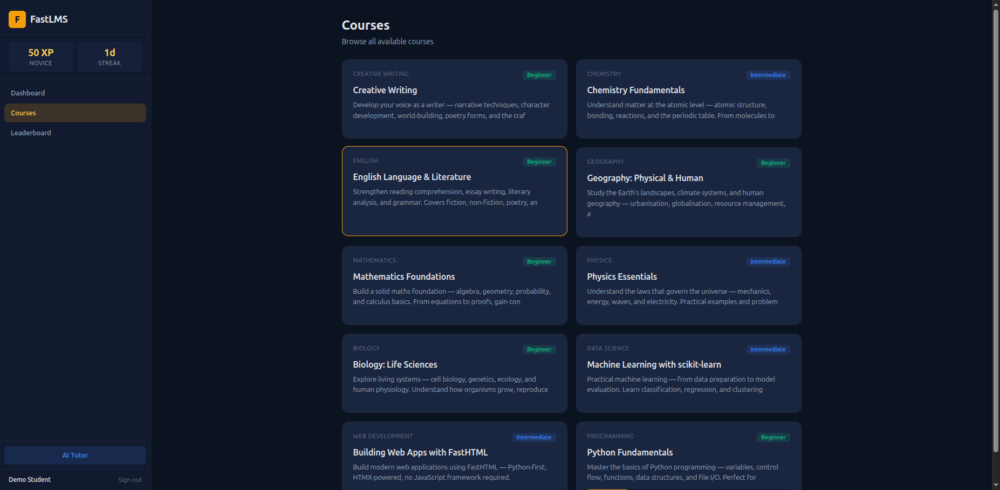

### 5. Course Detail

Click a course card to see its modules and lessons in a sidebar. Click **Enrol** to start tracking your progress. Then click any lesson to begin studying.

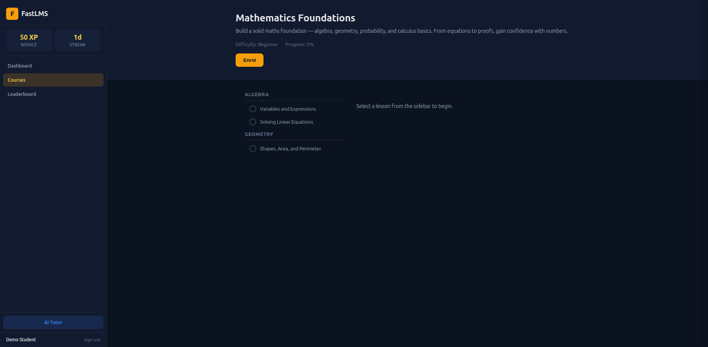

### 6. Lesson View

Lessons render rich markdown content — headings, bullet points, code blocks with syntax highlighting, blockquotes, and embedded video. The breadcrumb at the top links back to the course.

At the bottom you'll find action buttons:
- **Mark Complete** — awards XP and updates your streak
- **Take Quiz** — if the lesson has an attached quiz
- **AI Tutor** — opens a chat session with lesson context
- **Next Lesson** — proceeds to the next lesson in the module

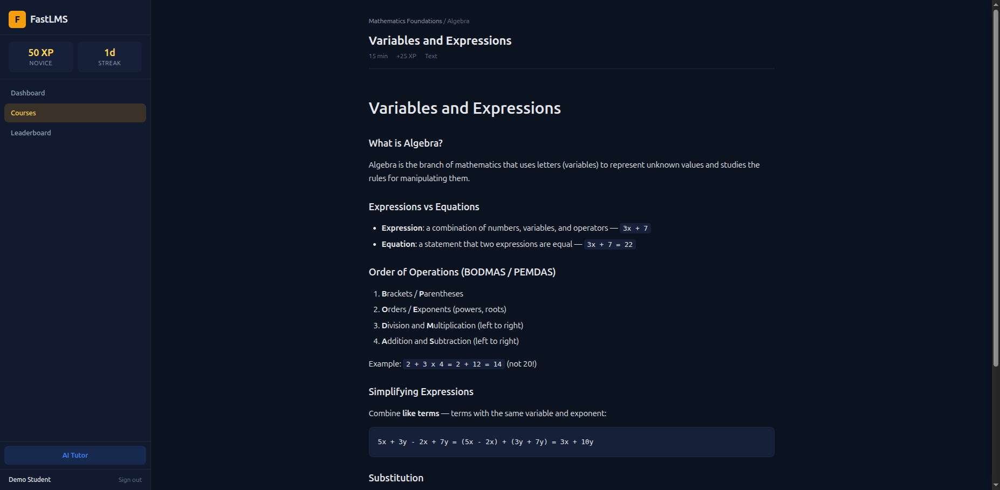

### 7. Completing a Lesson

Click **Mark Complete** to earn XP. The left nav updates immediately to show your new XP total and streak. The button changes to "Completed" so you know it's done.

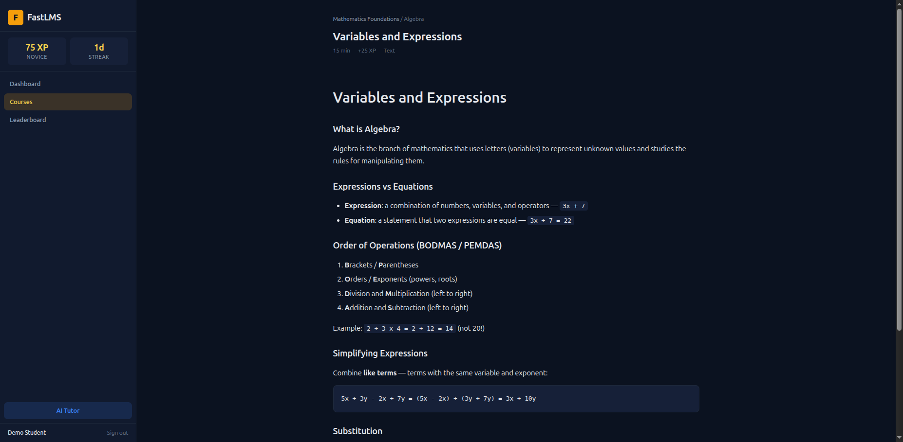

---

## Quizzes

### 8. Taking a Quiz

Quizzes are multiple-choice. The header shows the pass threshold and XP reward. Select one answer per question and click **Submit Quiz**.

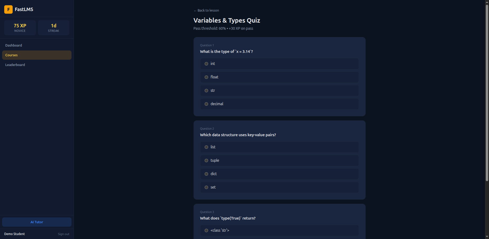

### 9. Quiz Results

After submission you see your score, whether you passed, and how much XP you earned. Each question shows your answer highlighted green (correct) or red (incorrect), plus an explanation.

If you didn't pass, click **Retry** to try again.

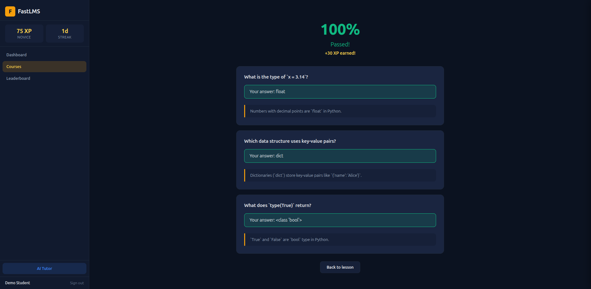

---

## Interactivity

### 10. Leaderboard

Click **Leaderboard** in the left nav to see all learners ranked by XP. The top 3 are highlighted. Each row shows the user's level badge and streak.

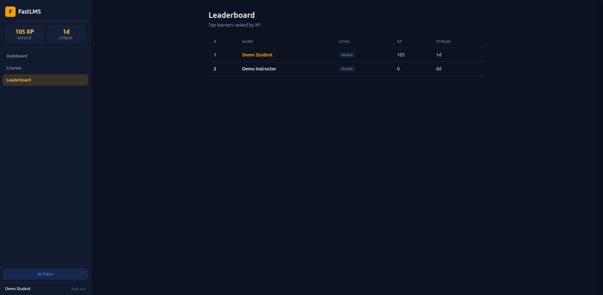

### 11. Profile

Click your name in the bottom-left to view your profile. It shows all your stats, a progress bar to the next level, and any badges you've earned.

**Levels**: Novice (0 XP) -> Apprentice (500) -> Scholar (2,000) -> Expert (5,000) -> Master (10,000) -> Grandmaster (25,000)

**Badges** are awarded automatically for milestones like completing your first lesson, maintaining streaks, acing quizzes, and reaching XP thresholds.

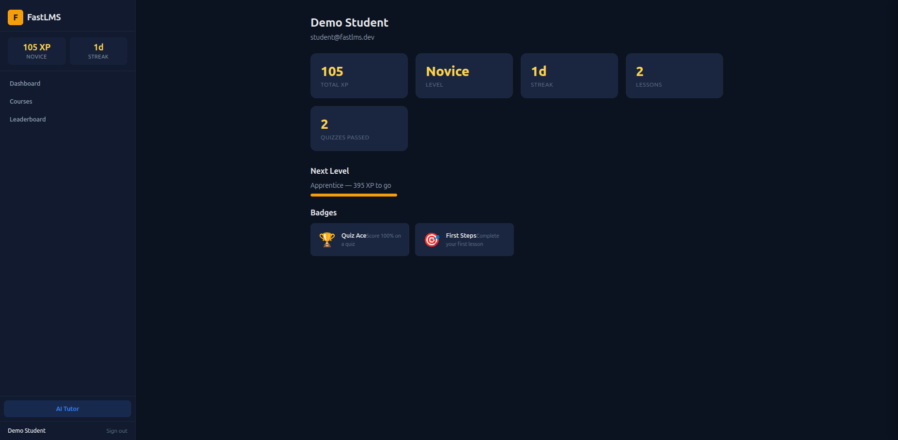

---

## AI Tutor

### 12. Chat

Click **AI Tutor** in the left nav or the **AI Tutor** button on any lesson. The chat opens with lesson context loaded — the AI knows what you're studying and can explain concepts, answer questions, and walk you through problems.

Messages stream in real-time via SSE. Chat history is saved per lesson so you can pick up where you left off.

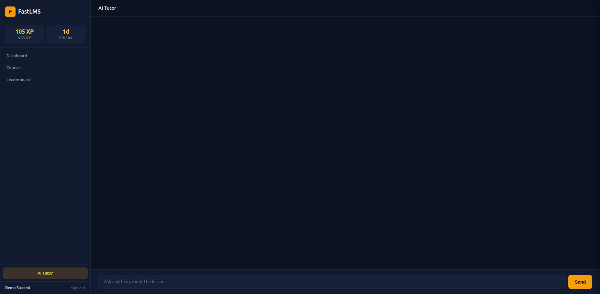

---

## For Instructors

### Managing Courses

Sign in with an instructor account and click **Manage Courses** in the left nav. From here you can:
- View all courses (published and draft)
- Create new courses with the **+ New Course** button
- Use the **Course Configuration** page (`/app/configure`) to add subjects, modules, and lessons through a guided form

### Course Configuration

Navigate to `/app/configure` or click **Course Config** in the left nav. The 5-step wizard guides you through:

1. **Create a new course** — set title, category, difficulty, and description — or select an existing course to edit

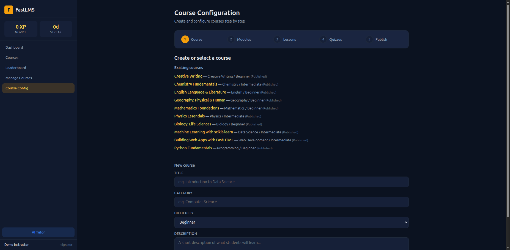

2. **Add modules** — define sections within the course, set ordering

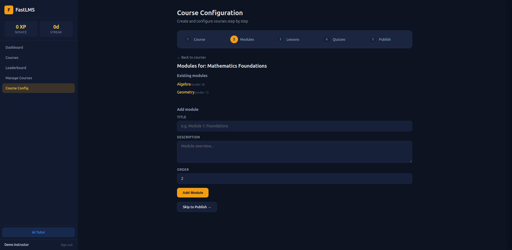

3. **Add lessons** — write markdown content, set XP rewards, duration, and optional video URL

4. **Add quizzes** — create a quiz for any lesson, then add multiple-choice questions with explanations

5. **Publish** — review course stats (modules, lessons, quizzes) and toggle published/draft status

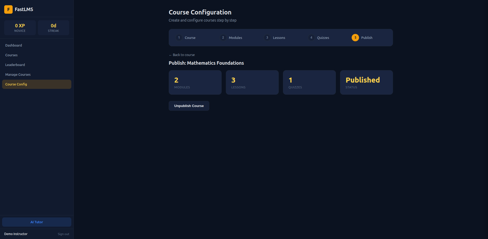

---

## Supported Courses

FastLMS ships with 10 ready-to-use courses covering programming and academic subjects:

### Programming & Technology
- **Python Fundamentals** — Variables, data types, control flow, functions, classes (Beginner)
- **Machine Learning with scikit-learn** — Supervised learning, model evaluation, pipelines (Intermediate)
- **Building Web Apps with FastHTML** — Server-side rendering, HTMX, database integration (Intermediate)

### Academic Subjects
- **Mathematics Foundations** — Algebra (variables, linear equations) and Geometry (shapes, area, perimeter) (Beginner)
- **Physics Essentials** — Mechanics: Newton's laws, motion, forces, energy (Intermediate)
- **Biology: Life Sciences** — Cell biology (organelles, membranes) and Genetics (DNA, inheritance, mutations) (Beginner)
- **Chemistry Fundamentals** — Atomic structure (elements, periodic table) and Chemical reactions (balancing, types) (Intermediate)
- **English Language & Literature** — Reading comprehension, essay writing, literary analysis, grammar (Beginner)
- **Geography: Physical & Human** — Landscapes, climate, urbanisation, globalisation, resource management (Beginner)
- **Creative Writing** — Narrative techniques, character development, world-building, poetry forms (Beginner)

Each course includes multiple modules with rich markdown lessons and multiple-choice quizzes.

---

## Animated Demo

